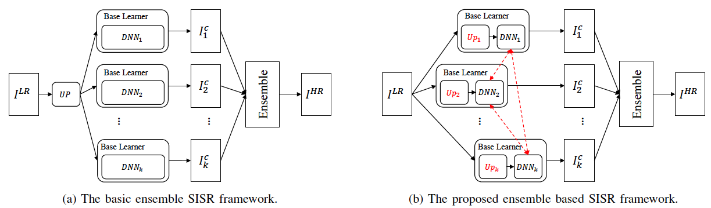
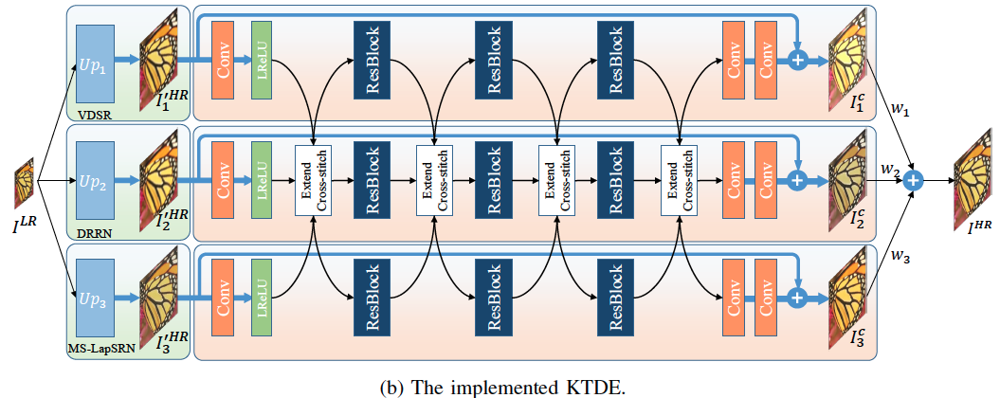
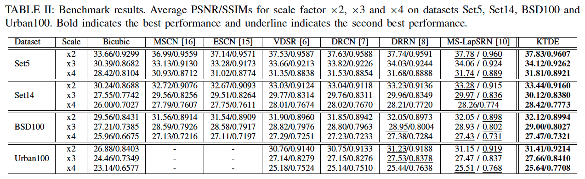

# Knowledge Transfer featured DNN Ensemble for SISR
The Pytorch source code of Chapter 6 in thesis [Training Deep Neural Networks via Multi-task Optimisation]
If you use this code, please cite the thesis.

This work proposes a novel framework of DNN ensemble for SISR which features "diversity introducing module" and "knowledge transfer module".

**diversity introducing module**: this module proactively improve the diversity between base learners which are favored by ensemble.

**knowledge transfer module**: this module transfer knowledge between base learners when they are on training to improve their performance so that the generated ensemble's performance is enhanced.

These two modules are demonstrated in the following figure. The proposed knowledge transfer featured ensemble model uses different upscaling methods (VDSR, DRRN, MS-LapSRN) as **diversity introducing module** and use extended cross-stitch unit as **knowledge transfer module**.



The architecture of the proposed network is as follows.


Testing results on benchmark.

****
# Usage

## Download and generate data
First, you need to download the 291 images dataset ([Google Drive](https://drive.google.com/open?id=10Ea6OCxNktlL635TJrBhPwiHjD1Vxzm_), [Baidu NetDisk](https://pan.baidu.com/s/1mciEH45l7bC5bkHmV4s7SQ) (password:3rpa)) and unzip it in the directory in "./data/".

Next, you need to generate the ".h5" formate of 291 dataset. You can use the matlab code "generate_train.m" provided in "./matlab" to generate the 2x, 3x, 4x datasets.

## Training
1. Use the following command for training MTO based ensemble.
```
python main_train.py -c configs/stacksr.json
```

2. Use the following command for training MTO based ensemble without knowledge transfer,
```
python main_train.py -c configs/stacksr_nonet.json
```

3. Use the following command for training MTO based ensemble with identical upscaling method,
```
python main_train.py -c configs/stacksr_3drrn.json
python main_train.py -c configs/stacksr_3vdsr.json
python main_train.py -c configs/stacksr_3lap.json
```

After training, the generated models are stored in folder "experiments".

## Testing
Use the following command for testing,
```
python main_test.py -c configs/stacksr.json
```
Modify the -c parameter to adapt your model.

## Plot
The figures can be generated via the script "get_curve.py". Note it should be run after training.
